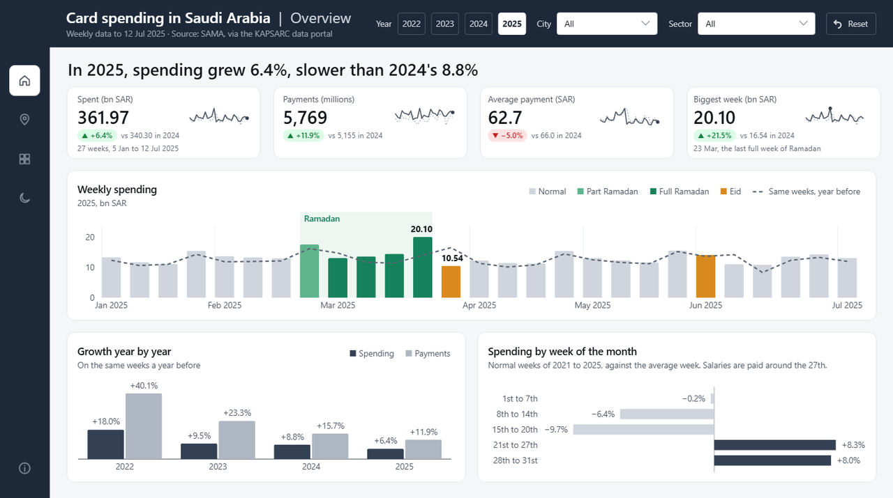
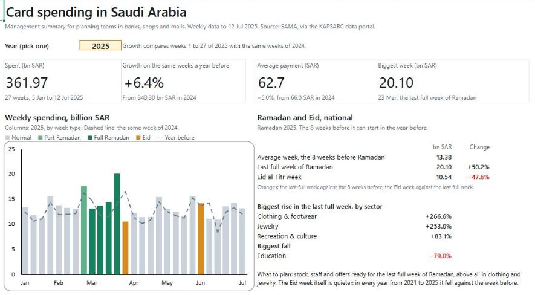

# Saudi Consumer Spending Intelligence

Weekly card spending in Saudi Arabia, by city and by sector, from May 2020 to July 2025.

**Status: in progress.** Stages 1 to 4 of 7 (extraction, cleaning and data-quality checks, SQL warehouse, SQL analysis)
are done, and stage 5 is built: a Power BI dashboard and an Excel management report. Next: a forecast.



## Data
- Source: Saudi Central Bank (SAMA), weekly point-of-sale (POS) transactions, published on the
  [KAPSARC Data Portal](https://datasource.kapsarc.org/explore/assets/point-of-sale-transactions-by-sector-and-city/). Licence: Public Domain.
- 31,262 rows covering 270 weeks (10 May 2020 to 6 July 2025).
- Measures: number of transactions (thousands) and value (thousand SAR), plus the week-on-week change % for each.
- Three levels in one table: the national total, 17 sectors (national only) and 11 cities (all sectors combined),
  including Khobar, Dammam, Riyadh and Jeddah. There is no city-by-sector breakdown.

## Data quality
[`explore/profile_raw.py`](explore/profile_raw.py) profiles the raw file and turns each finding into a check.
[`pipeline/clean.py`](pipeline/clean.py) applies the fixes below and checks the result before saving it.

| What the profile found | What the clean table does |
|---|---|
| The national total, the 17 sectors and the 11 cities are stored together, and each group adds up to the same money, so adding every row triples the total | A `level` column (national, sector, city). Totals are only taken within one level |
| One week is dated Saturday 20 June 2020; every other week starts on a Sunday | Moved to Sunday 21 June. SAMA's date is kept in `source_date` |
| The first week (10 May 2020) has no Change % | Left blank, not 0 |
| Sectors and cities add up to the national total within 4 thousand, because each number is published rounded to the nearest thousand | Checked every week, allowing 0.5 thousand per part |
| SAMA's Change % equals (this week / last week - 1) x 100 | Checked on every row |

Output: `data/clean/pos_weekly.csv`, one row per week per series (29 series x 270 weeks = 7,830 rows).
The script checks the table before saving and stops with a list of problems if any rule fails.

## SQL warehouse
A star schema in DuckDB, stored in one file (`data/warehouse.duckdb`). The tables are defined in
[`sql/schema.sql`](sql/schema.sql) and filled by [`pipeline/load.py`](pipeline/load.py).

| Table | Rows | One row is | Columns |
|---|---|---|---|
| `fact_weekly_spending` | 7,830 | one week of one series | `date_key`, `series_key`, `transactions_k`, `value_k_sar` |
| `dim_date` | 270 | one week | `date_key`, `week_start`, `source_date`, year, quarter, month, `week_of_year`, `ramadan_days`, `eid` |
| `dim_series` | 29 | one series | `series_key`, `series`, `level` |

- Primary and foreign keys refuse duplicates and broken links.
- The fact table keeps only numbers that can be added up; percentages are calculated in queries.
- `load.py` builds a new file, checks row counts and totals against the clean file, and only then replaces the old warehouse.
- Ramadan moves about 11 days earlier every year, so each week records how many of its 7 days fall in
  Ramadan (0 to 7) and which Eid, if any, falls in it. The dates are in
  [`data/reference/islamic_calendar.csv`](data/reference/islamic_calendar.csv), typed from the official
  [Umm al-Qura calendar](https://www.ummulqura.org.sa/en) (for 2020 to 2025 it matches the dates the
  Supreme Court announced after sighting the moon). `load.py` stops if a date breaks the calendar's rules
  (Ramadan is 29 or 30 days; Eid al-Adha comes 67 to 69 days after Eid al-Fitr) or if the data runs past
  the last year in the file.

## Findings
The queries are in [`sql/analysis/`](sql/analysis) (CTEs and window functions: `LAG`, `RANK`, `row_number`),
run by [`pipeline/analyse.py`](pipeline/analyse.py). Each result is saved in [`reports/analysis/`](reports/analysis).

### 1. Ramadan and Eid move spending more than anything else in the year
- In 2022, 2024 and 2025 the biggest national week of the year was the last full week of Ramadan, just
  before Eid al-Fitr (2025: 20.10 billion SAR in the week of 23 March). In 2021 and 2023 it was a week at
  the end of November.
- Full Ramadan weeks are 10.4% above the 8 weeks before Ramadan (national, average of 2021 to 2025; from
  7.6% in 2021 to 14.5% in 2025). The last full week before Eid is 33.4% above.
- Where the pre-Eid peak lands depends on where the week boundaries fall:

| Year | Ramadan days in the Eid al-Fitr week | Last full Ramadan week vs the 8 weeks before | Eid al-Fitr week vs the 8 weeks before |
|---|---|---|---|
| 2025 | 0 | +50.2% | -21.2% |
| 2022 | 1 | +55.2% | -18.3% |
| 2024 | 3 | +28.5% | -11.8% |
| 2021 | 4 | +21.4% | -3.7% |
| 2023 | 5 | +11.5% | +2.6% |

  When the Eid week still holds the last days of Ramadan, the final shopping days fall into it: the week
  before peaks less and the Eid week drops less. So each week needs its number of Ramadan days, not just a
  "Ramadan week" flag.

### 2. The Ramadan effect is very different by city and by sector
Full Ramadan weeks against the 8 weeks before, average of the 5 Ramadans from 2021 to 2025:
- **Cities:** Makkah +59.8% and Madina +19.4%, the two cities that receive Umrah visitors in Ramadan
  (Makkah's last week before Eid is +98.3%, about double a normal week). Then Jeddah +13.5%, Dammam +6.8%,
  Riyadh +5.3%, and Khobar lowest at +0.5% (between -2.1% and +6.8% across the five years).
- **Sectors:** Clothing and Footwear +113.4% (the last week before Eid is +208.1%, about three times a
  normal week) and Jewelry +74.9%. Restaurants & Café -19.9% (daytime fasting), Construction & Building
  Materials -20.7% and Education -29.4%.

### 3. Growth by city and sector
Average week, 2021 against 2024 (full years only):
- National +40.6%, from 9.08 to 12.78 billion SAR a week.
- Cities: Makkah +74.4%, Riyadh +52.8% and Madina +50.1% grew fastest; Dammam +29.6% was 8th of 11 and
  Khobar +18.0% last.
- Sectors: Miscellaneous Goods and Services +86.2% and Hotels +70.3% grew fastest (then "Other" +67.1% and
  Gas Stations +64.9%); Electronic & Electric Devices fell 23.6%.

2025 so far (weeks 1 to 27) against the same weeks of 2024:
- National +6.4%. Riyadh +10.9% leads; Khobar and Dammam (both +8.4%) grew faster than the national rate,
  unlike 2021 to 2024.
- Jewelry +28.5%; Electronic & Electric Devices -28.5% and Public Utilities -39.2%.

### How the comparisons were kept fair
- Cities are ranked only against cities, and sectors against sectors, because each level adds up to the
  same national total.
- Full-year growth uses the average week, not the total, because 2023 has 53 weeks and the other years 52.
  Totals would show 2023 growing 11.9% instead of 9.8%, and 2024 growing 6.5% instead of 8.6%.
- 2025 is compared with the same 27 weeks of 2024 (one Ramadan and both Eids in each), and `analyse.py`
  stops if two compared periods hold different numbers of weeks.
- Spending rises at every month end (payday). Ramadan is compared with the 8 weeks just before it, which
  hold two month ends, as its 3 or 4 full weeks hold about one; otherwise payday's rise would be credited
  to Ramadan. The week of Ramadan's first day is left out of both groups, because it mixes the
  stocking-up days with Ramadan days.

### Limits
- POS data counts card payments at shop terminals only. Growth mixes real spending, higher prices and the
  move from cash to cards, so it is not the same as growth in consumption.
- Large moves in small sectors (Public Utilities -39.2% in 2025) may come from changes in how shops are
  classified. Check them against SAMA's weekly reports before using them.

## Power BI dashboard
Five pages for a planning team at a bank, a retailer or a mall operator:

| Page | The question it answers |
|---|---|
| Overview | How big is card spending, how fast is it growing, and when in the month do people spend? One or more cities, or one or more sectors, can be picked |
| [Cities](reports/figures/dashboard_2_cities.png) | Where is the money spent, which cities grow fastest, and where is each payment biggest? |
| [Sectors](reports/figures/dashboard_3_sectors.png) | What do people spend on, and does growth come from more payments or bigger ones? |
| [Ramadan and Eid](reports/figures/dashboard_4_ramadan_and_eid.png) | When is the biggest season of the year, and what should be ready for it? |
| [About](reports/figures/dashboard_5_about.png) | What each page answers, the words used, and the limits of the data |

**Model.** [`pipeline/export.py`](pipeline/export.py) exports the warehouse to Parquet files in `data/powerbi/`,
because Power BI has no DuckDB connector and Parquet keeps every column's type. Power BI gets one fact table
per level (national 270 rows, city 2,970, sector 4,590), so every measure is a plain sum and a city total can
never be added to a sector total. `export.py` stops unless the three files together hold every row and riyal of
the warehouse's fact table (each file adds up to 2,937.77 billion SAR). It also writes the week labels the pages
use: the week type (normal, part or full Ramadan, Eid), the Ramadan phase and the day of the month a week starts.

**Report.** Saved as a Power BI Project in [`powerbi/`](powerbi): the model (TMDL) and the pages (JSON) are text
files, so every change shows up in Git. 42 DAX measures. Choices worth knowing:
- Growth compares the same week numbers a year before, using only weeks found in both years, because 2025 has
  27 weeks so far and 2023 has 53.
- The titles are DAX measures, so they follow the filters: "In 2025, spending in Khobar grew 8.4%, faster than
  2024's 5.8%".
- The source has no sector figures inside a city. When a city and a sector are both picked, the Overview shows
  "Pick cities or sectors, not both" instead of a number that would be wrong.
- The Year filter can't be cleared, because the titles and the growth figures need one year.

[`powerbi/checks.dax`](powerbi/checks.dax) holds 28 test queries with the expected result of each, for example
the 2025 national total (361.97 billion SAR, +6.4%) and the Ramadan figures above. Paste them into DAX query
view to re-check the numbers after a refresh.

## Excel management report
[`pipeline/excel_report.py`](pipeline/excel_report.py) builds
[`reports/excel/saudi_spending_report.xlsx`](reports/excel/saudi_spending_report.xlsx) from the same Parquet files
as the dashboard: one printable page (landscape A4) for a manager who works in Excel.



- One input cell: pick a year from 2022 to 2025, and every number, both tables and the chart follow it.
- Every figure is a formula (SUMIFS, MAXIFS, AVERAGEIFS, INDEX/MATCH, LARGE) on a Calc sheet, over a Data sheet
  of 7,830 rows, so each number can be traced back to the data. Cities are ranked by growth and sectors by size
  with LARGE and INDEX/MATCH.
- The chart colours each week by type (one column series per type), and its ranges are named ranges that stop
  at the year's last week, so 2025 shows 27 weeks and 2023 shows 53.
- The figures match the dashboard's, for example 2025: 361.97 billion SAR, +6.4% on the same weeks of 2024.

## Plan
1. Extract: download the data from the API, with checks ✅
2. Clean the data and run data-quality checks ✅
3. Load it into a SQL warehouse (star schema) ✅
4. Analyse seasonality (Ramadan, Eid), city trends and sector growth with SQL ✅
5. Build a Power BI dashboard and an Excel management report ✅
6. Forecast the next quarter
7. Automate the refresh and publish

## Run it (Windows)
```powershell
python -m venv .venv
.venv\Scripts\python -m pip install -r requirements.txt
.venv\Scripts\python pipeline/extract.py
.venv\Scripts\python pipeline/clean.py
.venv\Scripts\python pipeline/load.py
.venv\Scripts\python pipeline/analyse.py
.venv\Scripts\python pipeline/export.py
.venv\Scripts\python pipeline/excel_report.py
```
The raw file is saved to `data/raw/pos_transactions.csv`, the clean table to `data/clean/pos_weekly.csv`,
the warehouse to `data/warehouse.duckdb`, the analysis results to `reports/analysis/`, the files for
Power BI to `data/powerbi/` and the Excel report to `reports/excel/`.

To open the dashboard: open `powerbi/saudi_spending.pbip` in Power BI Desktop, set the `DataFolder` parameter
(Home > Transform data > Edit parameters) to the full path of your `data\powerbi\` folder, then select Refresh.
`.venv\Scripts\python explore/profile_raw.py` prints the data profile and re-checks every finding on the raw file.

## Author
Mohamed Ellithy · [LinkedIn](https://www.linkedin.com/in/mohamed-el-lithy/)
