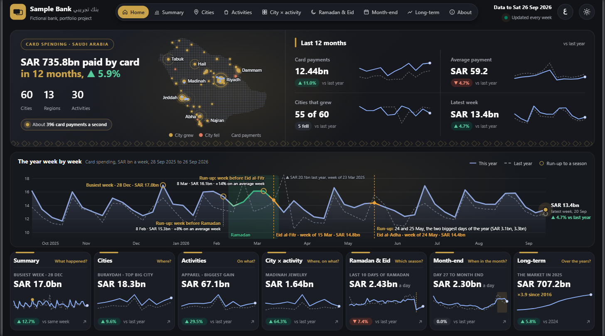
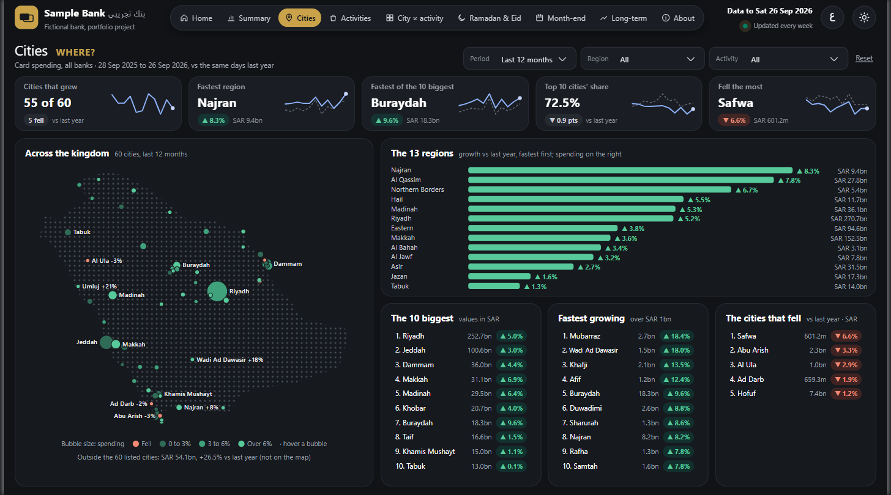
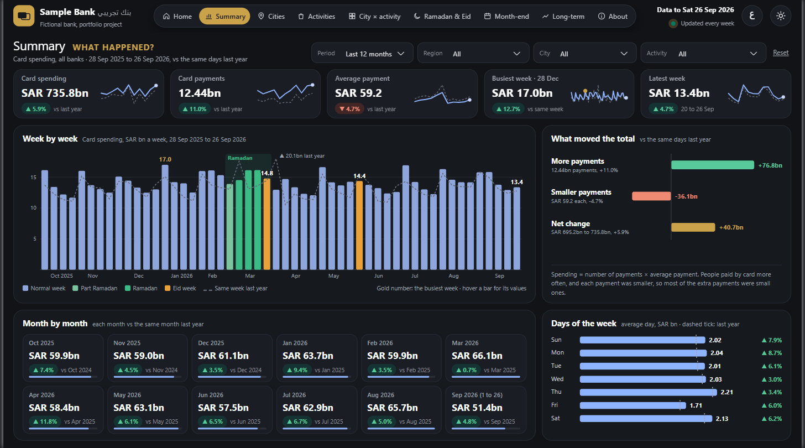
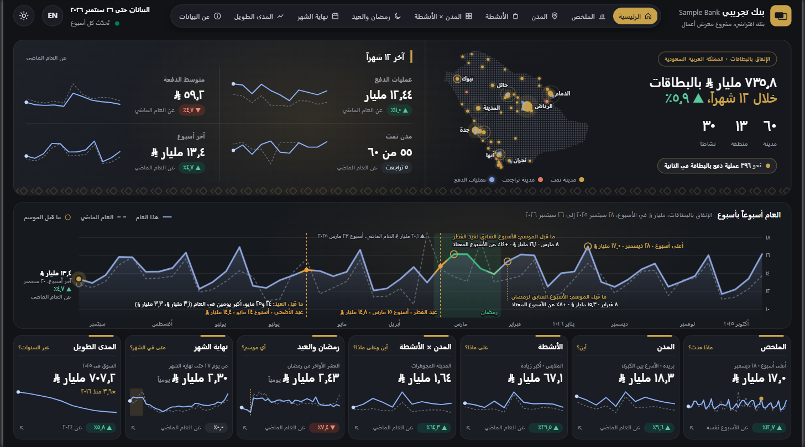
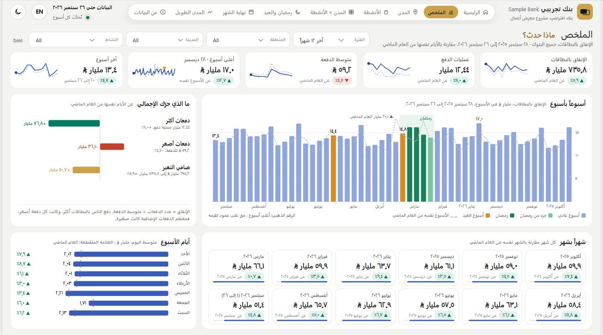

# Saudi Consumer Spending Intelligence

Card spending in Saudi Arabia by city, by activity and by day, from the Saudi Central Bank's (SAMA) open data.

**Open the dashboard:** [mellithyy.github.io/saudi-consumer-spending-intelligence](https://mellithyy.github.io/saudi-consumer-spending-intelligence/)

Nine pages, each in English and Arabic, in a night and a light theme, with their filters. It opens in any browser,
phones included (turn the phone sideways).

## What it shows
The 12 months to 26 September 2026, against the same days a year before:
- SAR 735.8 billion was paid by card, up 5.9%: about 396 card payments a second.
- The number of payments grew 11.0% while the average payment fell 4.7% (to SAR 59.2): people paid by card more
  often, and the extra payments were mostly small ones.
- 55 of the 60 cities grew. Najran was the fastest region (+8.3%) and Buraydah the fastest of the 10 biggest cities
  (+9.6%); the 10 biggest cities hold 72.5% of all spending.
- 16 of 19 activities grew: Apparel added the most (+15.3 billion SAR, +29.5%) and Jewelry grew fastest (+33.1%).
- Days 27 to 31, from the government payday to the month's end, are 16% a day above days 1 to 26. Six of the 12
  paydays moved off the 27th for a weekend or an Eid.
- Ramadan 1447: 66.5 billion SAR in 30 days, 2.2 billion a day, up 1.3% a day on Ramadan 1446 (29 days).

## The pages
| Page | The question it answers |
|---|---|
| Home | How much was paid by card in the last 12 months, and how fast is it growing? One card opens each page |
| Summary | What happened: spending, payments and the average payment, week by week, month by month and by day of the week |
| Cities | Where: the 13 regions, the 60 cities on a map, the biggest, the fastest growing and the cities that fell |
| Activities | On what: the change in each activity, its share of spending and its average payment |
| City × activity | Where and on what: a tree from the kingdom down to each region, city and activity, with the spending, payments and growth of every box (click a box to open it), and each activity's growth in the 10 biggest cities |
| Ramadan & Eid | Which season: the days around Eid al-Fitr and Eid al-Adha against the year before, and the whole year day by day |
| Month-end | When in the month: the average day by day of the month, and every payday of the year |
| Long-term | Over the years: the market since 2016, and 16 long series since 2020 |
| About | Where the numbers come from, what each one means, and the checks and limits |

| | |
|---|---|
|  |  |
|  |  |

## How it was built
- **Data.** SAMA's Open Data Portal: daily numbers since 1 January 2024 for 60 cities in 13 regions and 19 activities
  (about 3.8 million numbers, downloaded from the portal's web form); the monthly table for 2016 to 2023; and the
  312 weekly PDF reports SAMA has published since June 2020.
- **Checks.** The daily data, added up into Sunday-to-Saturday weeks, equals SAMA's weekly reports for every city
  within rounding. One week (24 to 30 March 2024) is short in the report, about half of Saturday 30 March is missing,
  so the daily data is used there. Every day, the activities add up to the total and the cities to the kingdom.
- **Model.** A star schema built in SQL (DuckDB). A refresh script reruns every step behind the checks: a check that
  fails stops the run, and the last approved tables stay in use.
- **Report.** Power BI, with DAX measures that write the HTML and SVG of every card and chart, and a Deneb (Vega)
  treemap. The Arabic pages read right to left, with Arabic digits and the Saudi riyal sign.
- **Web copy.** The page above is the same report in one file: every page, language, theme and saved filter state
  (970 states), taken from the Power BI model and placed where the report puts each part. A layout check measured
  every part of every state for a line, dot or word past its frame. The spending tree on City × activity exists only
  in this web copy, since Power BI's HTML visual cannot be clicked. It is drawn from the model's own rows, and the
  build stops unless its totals match the report.

Tools: Python (pandas, requests), SQL (DuckDB), Power BI (DAX, Deneb), headless Microsoft Edge for the checks.

"Sample Bank" in the dashboard is a fictional bank: the numbers are SAMA's as published, the analysis is the author's.
The source code, the data and the Power BI files are kept private, and can be walked through in an interview.

## Author
Mohamed Ellithy, Data Analyst, Al Khobar · [LinkedIn](https://www.linkedin.com/in/mohamed-el-lithy/)
